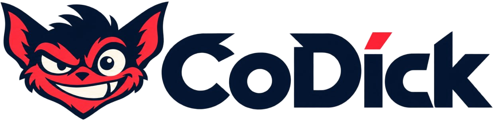
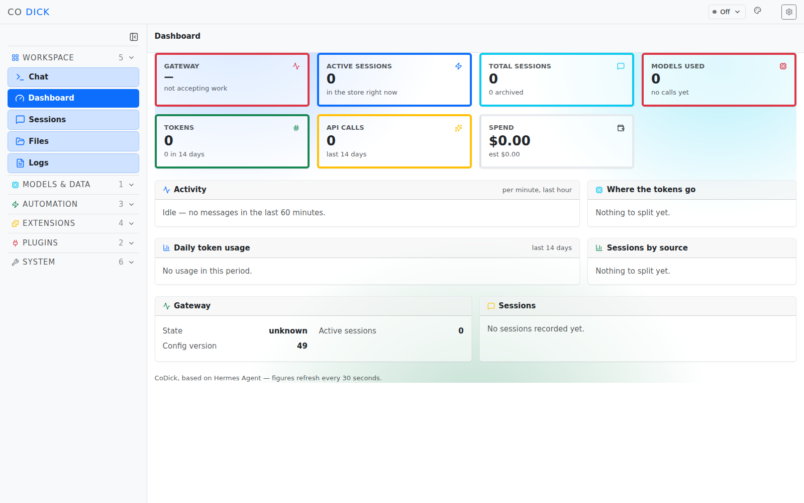

<p align="center">
  
</p>

<p align="center">
  <b>A web dashboard for Hermes Agent, rebuilt on Bootstrap 5.</b>
</p>

<p align="center">
  <a href="LICENSE"></a>
  <a href="https://github.com/NousResearch/hermes-agent"></a>
  <a href="https://hermes-agent.nousresearch.com/docs/"></a>
  
</p>

---

> ### Not an official Nous Research product
>
> CoDick is an independent project built on
> [Hermes Agent](https://github.com/NousResearch/hermes-agent) by
> [Nous Research](https://nousresearch.com). It is not affiliated with, endorsed
> by, or supported by Nous Research.
>
> The agent — CLI, gateway, TUI, tools — is upstream's and is used unmodified.
> **This repository's work is the web interface.** The upstream `LICENSE`, MIT
> `Copyright (c) 2025 Nous Research`, is retained byte for byte, as the licence
> requires.
>
> Bugs, security reports and support for the *agent* belong
> [upstream](https://github.com/NousResearch/hermes-agent/issues).



## What this project is

Hermes Agent ships a web dashboard. CoDick replaces that interface — not a
reskin of it, a rebuild. Tailwind and the previous component library are
**removed**, not reconfigured, and every surface, control and colour comes from
Bootstrap's own palette.

| | |
|---|---|
| **Dashboard at `/`** | Gateway state, sessions, models, tokens, spend, per-minute activity and token composition on one screen |
| **A shell that is only navigation** | Grouped, collapsible sections; identity, status and settings in one strip across the top |
| **Light by default** | Bootstrap's own light mode, set explicitly so the user's `prefers-color-scheme` cannot decide it |
| **Charts in SVG** | Reading Bootstrap's variables, so they follow the colour mode instead of importing a chart library's |

Everything on the dashboard is read from an API that already existed — the
status poll, the session stats, the usage analytics — settled independently, so
one failing endpoint leaves a partial dashboard rather than a blank page. The
per-minute track is bucketed from session timestamps: an idle system draws a
flat line and says so, rather than showing a plausible curve.

The Bootstrap migration that produced this was carried out on a fork, which
stays public so the progression of that work remains visible:
[martinroot/hermes-multiserver-web-bootstrap](https://github.com/martinroot/hermes-multiserver-web-bootstrap).

## Running it

The agent is installed and updated exactly as upstream documents — CoDick does
not replace the installer, and the CLI is still `hermes`:

```bash
curl -fsSL https://hermes-agent.nousresearch.com/install.sh | bash
```

Then, from a checkout of this repository:

```bash
hermes dashboard
```

The interface is built from `web/`; the backend serves the built assets from
`hermes_cli/web_dist`. To work on the interface itself:

```bash
npm install --workspace web
npm run build --workspace web
```

Full agent documentation — providers, channels, skills, scheduled jobs — is
upstream's, and unchanged:
[hermes-agent.nousresearch.com/docs](https://hermes-agent.nousresearch.com/docs/).

## About the agent

**Hermes Agent is by [Nous Research](https://nousresearch.com)** — a
self-improving AI agent with a built-in learning loop: it creates skills from
experience, improves them during use, searches its own past conversations, and
builds a deepening model of who you are across sessions. It runs on a $5 VPS, a
GPU cluster, or serverless infrastructure that costs nearly nothing when idle.

Use any model you want — [Nous Portal](https://portal.nousresearch.com),
OpenRouter, OpenAI, your own endpoint, and
[many others](https://hermes-agent.nousresearch.com/docs/integrations/providers).
Switch with `hermes model`: no code changes, no lock-in.

| | |
|---|---|
| **A real terminal interface** | Full TUI with multiline editing, slash-command autocomplete, conversation history, interrupt-and-redirect, streaming tool output |
| **Lives where you do** | Telegram, Discord, Slack, WhatsApp, Signal and CLI from a single gateway process |
| **A closed learning loop** | Agent-curated memory with periodic nudges, autonomous skill creation, FTS5 session search with LLM summarisation |
| **Scheduled automations** | Built-in cron scheduler with delivery to any platform, in natural language |
| **Delegates and parallelizes** | Spawns isolated subagents for parallel workstreams |
| **Runs anywhere** | Local, Docker, SSH, Singularity, Modal, Daytona, Vercel Sandbox |

## Project layout

```
web/            the interface — React, Vite, Bootstrap 5.3
hermes_cli/     upstream's Python package; web_server.py serves the built assets
apps/           upstream's desktop client
plugins/        upstream's bundled plugins
```

## Credits

This project was built on the generosity of
[OpenRouter](https://openrouter.ai/stealth/space-bunny-alpha): the work above —
several thousand class replacements, a shell rebuilt, a dashboard written — ran
on `stealth/space-bunny-alpha` with the unlimited tokens of the *Boost skill day*
programme. Were that the norm rather than the occasion, the open-source market
would move a good deal faster.

The agent is by [Nous Research](https://nousresearch.com) and remains under its
original MIT licence, `Copyright (c) 2025 Nous Research`, retained unchanged.
CoDick's modifications are the work of this repository's contributors.
